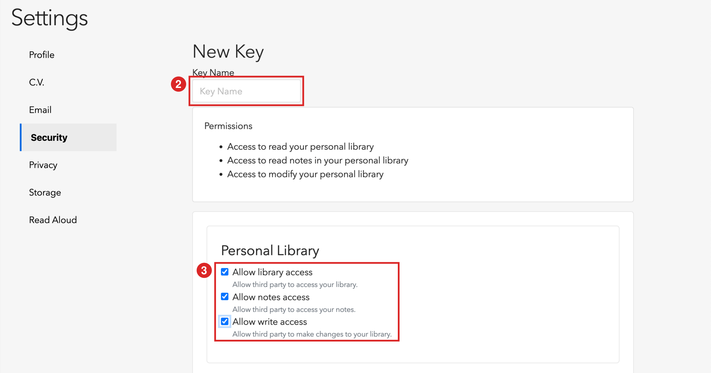
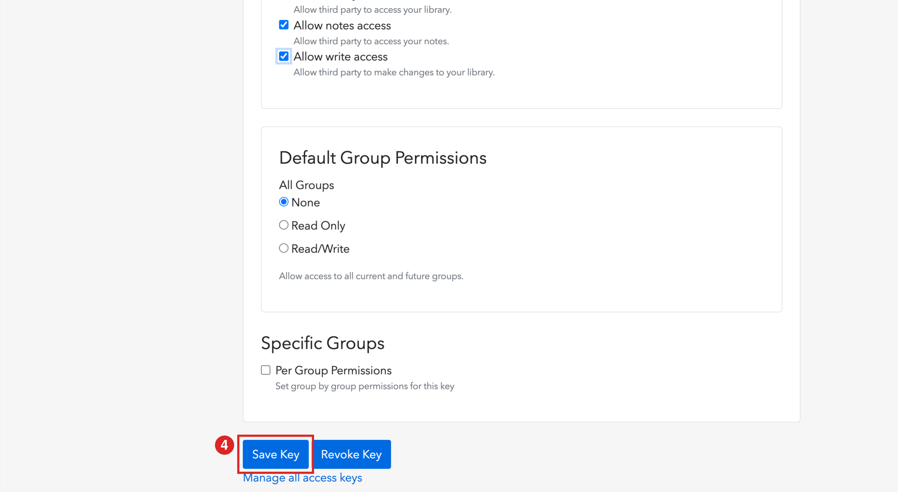
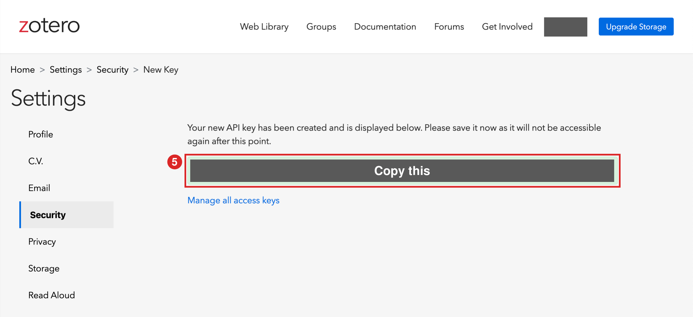

# Create a Zotero API key ／ 建立 Zotero API 金鑰

paper-ask and zotero-llm-wiki use this key to add grey AI highlights to your PDFs. The key is a password: **never paste it into a chat with Claude.**

paper-ask 和 zotero-llm-wiki 用這把金鑰在 PDF 上畫灰色 AI 標註。金鑰等於密碼：**不要貼進和 Claude 的對話裡。**

Before you start, make sure Zotero is signed in and syncing (Zotero Settings → Sync). Syncing data is enough; files don't need to sync.

開始前，確認 Zotero 已登入並開啟同步（Zotero 設定 → 同步）。同步資料就夠，PDF 檔不用同步。

## 1. Open the key page ／ 打開金鑰頁面

Go to <https://www.zotero.org/settings/keys> and sign in. Click **Create new private key**.

到 <https://www.zotero.org/settings/keys> 登入，按 **Create new private key**。


## 2–3. Name it and tick three permissions ／ 取名並勾選三個權限

Type any name, for example `paper-ask`. Under **Personal Library**, tick all three:

- **Allow library access**
- **Allow notes access**
- **Allow write access**

名稱隨便取，例如 `paper-ask`。在 **Personal Library** 底下三個都要勾。



## 4. Save ／ 儲存

Leave the group permissions as **None**, scroll down and click **Save Key**.

群組權限維持 **None**，往下捲，按 **Save Key**。



## 5. Copy the key ／ 複製金鑰

The new key appears in the green box. Zotero shows it **only once**, so keep this page open until the next step is done.

新金鑰會出現在綠色框裡。Zotero **只會顯示這一次**，做完下一步之前不要關掉這頁。



## 6. Save the key on your computer ／ 把金鑰存到電腦

The order matters, because the command reads the clipboard when you press Enter:

1. Open a terminal (Windows: **PowerShell**; macOS: **Terminal**). Not the chat with Claude.
2. Paste the command below and **don't press Enter yet**.
3. Go back to the web page and copy the key.
4. Return to the terminal and press Enter.

順序很重要，指令在按 Enter 那一刻才讀剪貼簿：

1. 打開終端機（Windows 開 **PowerShell**，macOS 開「**終端機**」），不是和 Claude 的對話框。
2. 貼上下面的指令，**先不要按 Enter**。
3. 回網頁複製金鑰。
4. 回終端機按 Enter。

Windows (PowerShell):

```powershell
New-Item -ItemType Directory -Force "$HOME\.config\zotero" | Out-Null; (Get-Clipboard).Trim() | Set-Content -NoNewline -Encoding ascii "$HOME\.config\zotero\api_key"
```

macOS (Terminal):

```bash
mkdir -p ~/.config/zotero && pbpaste > ~/.config/zotero/api_key && chmod 600 ~/.config/zotero/api_key
```

Then tell Claude it's saved. Claude checks the key and prints your Zotero user ID if it works.

存好後告訴 Claude，它會檢查金鑰，成功的話會印出你的 Zotero 帳號編號。

## If the check fails ／ 檢查失敗時

- **"Invalid Zotero API key"**: the clipboard probably held the command instead of the key. Copy the key again, press ↑ in the terminal to bring the command back, and press Enter.
- **Lost the key page**: create a new key (steps 1–5) and delete the unused one on the same page.

- **「Invalid Zotero API key」**：剪貼簿裡可能是指令本身，不是金鑰。重新複製金鑰，在終端機按 ↑ 叫回指令，再按 Enter。
- **金鑰頁面已經關掉**：重新建立一把（步驟 1–5），並在同一頁刪掉沒用到的那把。
